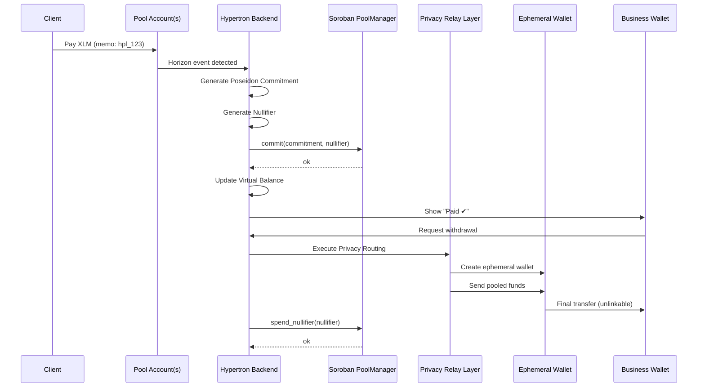

 🪩 Hypertron Privacy Layer

Private Onboarding + Payments + Darkpool-Style Settlement
Built on the Stellar Development Foundation network

## 🚀 Overview

Hypertron enables **private, workflow-native payments** for businesses—powered by Stellar Protocol 25 (X-Ray), Poseidon commitments, and a custom Privacy Relay Layer.

Businesses can:

* Create custom onboarding flows
* Collect payments privately
* Avoid exposing payer wallet addresses
* Withdraw funds without on-chain linkability
* Maintain an auditable history via commitments + nullifiers

Hypertron brings **darkpool-style privacy** to **B2B onboarding + payments**, without requiring an L2 or MPC.

---

## ✨ Features

### 🔹 **Custom Onboarding Flows**

* Forms, documents, agreements, borrower steps
* All combined into a single workflow link
* Auto-generates payment links after onboarding completion

### 🔹 **Private Payments**

* Client pays via Stellar
* Payment enters a shared pool
* Business **never** sees payer address
* Memo-based attribution

### 🔹 **ZK-Friendly Commitment Layer**

Using Stellar X-Ray primitives:

* Poseidon hashing
* BN254 operations
* Commitment + nullifier storage
* Prevents double-spend
* Keeps attribution private

### 🔹 **Privacy Relay Layer (Darkpool Settlement)**

Withdrawals routed through:

* One-time ephemeral wallets
* Multi-hop randomized routing
* Batching
* Timing obfuscation
* Amount jitter (±0.000001 XLM)

This breaks on-chain graph correlation.

### 🔹 **Virtual Balances**

Businesses see:

* Total received
* Pending withdrawals
* Completed payouts
  But never any on-chain flows.

## 🔁 End-to-End Flow (Sequence)

---

## 🧩 Core Components

### **1. Payment Links**

* Business configures workflow & amount
* Client pays to shared pool
* Memo tags identify workflow

### **2. Attribution Engine**

* Matches memo → workflow
* Creates zk-friendly commitment
* Registers nullifier

### **3. PoolManager Contract**

* Stores commitments
* Tracks nullifiers
* Enforces double-spend protection
* Does *not* reveal balances

### **4. Privacy Relay Layer**

* Multi-hop routing
* Ephemeral wallets
* Batching
* Time randomization
* Amount jitter
* Breaks blockchain graph analysis

### **5. Business Dashboard**

* Virtual balance
* Payment events
* Withdrawals
* Workflow history

---

## 🛡 Security Model

### Privacy Guarantees

| Actor    | Can See                         | Cannot See                    |
| -------- | ------------------------------- | ----------------------------- |
| Business | Paid ✔ events, amount, workflow | Payer wallet, pool outflows   |
| Client   | Payment sent                    | Business balances/withdrawals |
| Observer | Pool inflow/outflow             | Mapping between them          |
| Contract | Commitments, nullifiers         | Identities, balances          |

### Integrity Guarantees

* Commitments must match real payments
* Nullifiers prevent double withdrawals
* Routing engine cannot break protocol rules

---

## 🧰 Tech Stack

* **Backend**: Node.js / TypeScript
* **Smart Contracts**: Soroban (Rust)
* **Hash Functions**: Poseidon / Poseidon2
* **Curves**: BN254 via Protocol 25
* **Routing Layer**: Multi-hop ephemeral wallets
* **Frontend**: React / Next.js

---

## 🗺 Roadmap

* [x] Payment link attribution
* [x] Commitment + nullifier registry
* [x] Onboarding flow builder
* [x] Virtual balance engine
* [x] Ephemeral withdrawal accounts
* [ ] Batch withdrawal system
* [ ] Multi-pool routing
* [ ] Full ZK proof-of-withdrawal
* [ ] Audit ZK attestations

