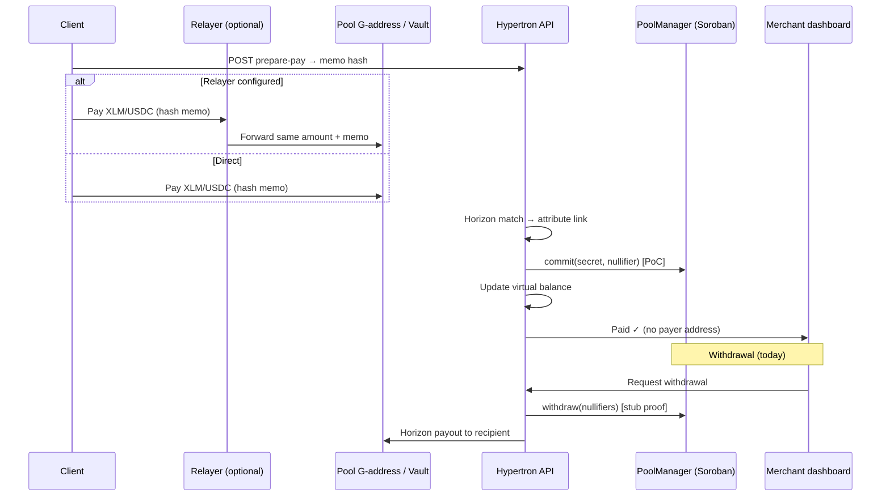

## User Onboarding Review Sheet

https://docs.google.com/spreadsheets/d/1t3ZQOgel-9NhzT6k8WI7Pu-mJnA12t2xoRACP4Mx6uA/edit?usp=sharing

## 🚀 Overview

Hypertron is a **B2B payments and operations layer on Stellar** — payment links, treasury vaults, onboarding workflows, cross-chain USDC bridging, and an AI compliance stack. Optional **private settlement** lets merchants collect payments without seeing the payer’s wallet (testnet beta).

**Documentation**

| Doc | Link |
| --- | --- |
| API routes | [docs/API.md](docs/API.md) |
| Product docs (in app) | `/doc` |
| Technical architecture | `/doc/technical/overview` |
| **Privacy payments (Phase 1 → 2)** | `/doc/technical/privacy-payments` |

> ⚠️ **Testnet beta — not audited.** Private settlement and PoolManager are work in progress. Do not use with real funds until audit + mainnet launch.

**What businesses can do today**

* Create payment links and onboarding workflows
* Collect XLM/USDC to a shared pool, relayer, or per-business vault
* Opt in to **confidential checkout** (hash memo + relayer — payer hidden from merchant)
* Track **virtual balances** and withdraw to a Stellar wallet
* Bridge USDC via Circle CCTP (Ethereum, Avalanche, Solana ↔ Stellar)
* Run AI compliance analysis (RegIntel, Compliance Agent)

Hypertron is the **merchant layer** on Stellar. Cryptographic ZK privacy (amount hiding, unlinkable withdrawals) is planned via integration with [Nethermind’s Stellar private payments reference](https://github.com/NethermindEth/stellar-private-payments) — see [Privacy roadmap](#-privacy-payments) below.

---

## ✨ Features

### 🔹 Payment links & checkout

* Fixed or flexible amount; XLM or USDC
* Public pay page at `/pay/[id]` with Freighter signing
* Memo-based attribution (text memo) or **hash memo** for private settlement
* Optional **relayer** so the pool only sees relayer → pool, not payer → pool
* Per-business **treasury vaults** (custodial / hybrid / external)

### 🔹 Private settlement (Phase 1 — operational privacy)

When `NEXT_PUBLIC_POOLMANAGER_CONTRACT_ID` is set (or `NEXT_PUBLIC_ENABLE_PRIVATE_SETTLEMENT=true`):

* Customer opts in at checkout
* `prepare-pay` issues a one-time **SHA-256 memo hash** (`PendingPaymentMemo`)
* Payment matched on Horizon; backend registers a **Poseidon commitment + nullifier** on Soroban **PoolManager** (PoC)
* Merchant sees **Paid ✓** and amount — **not** the payer address (when relayer + hash memo are configured)

**Phase 1 solves a real merchant problem:** *“The business shouldn’t see who paid.”*

**Phase 2** (planned) adds **cryptographic privacy** via [Nethermind’s ZK pool](https://github.com/NethermindEth/stellar-private-payments) — shielded UTXOs, Groth16 proofs, client-held notes, unlinkable withdrawals.

Full comparison and migration plan: **[Technical docs → Privacy payments](/doc/technical/privacy-payments)**.

### 🔹 Fee sponsorship (CAP-40 fee bump)

When enabled, payers sign the inner payment; a **sponsor account** wraps it in a **fee bump** so the sponsor pays the network fee.

* **Flow:** `prepare-pay` → build inner tx → Freighter signs → `POST /api/payment-link/[id]/submit-sponsored-pay` → server validates destination, amount, memo → sponsor submits fee bump
* **Code:** `frontend/src/lib/fee-sponsor-server.ts`, `frontend/src/app/api/payment-link/[id]/submit-sponsored-pay/route.ts`

| Variable | Required | Description |
| -------- | -------- | ----------- |
| `FEE_SPONSOR_SECRET` | Yes, to sponsor | Sponsor secret key (server only) |
| `NEXT_PUBLIC_FEE_SPONSOR_PUBLIC_KEY` | Yes, for UX | Sponsor public key; enables sponsored pay UI |
| `FEE_SPONSOR_MAX_FEE_STROOPS` | No | Max outer fee; default `100000` |

### 🔹 PoolManager (Soroban — Phase 1 PoC)

Rust contract in `contracts/poolmanager/`:

* `commit` — Poseidon leaf + nullifier registry (token deposit intended; SDK integration in progress)
* `withdraw` — nullifier spend + payout (**ZK verifier is stubbed** — not production privacy)
* ASP-style **approve / block** depositor maps, pause, protocol fees
* Rolling Poseidon accumulator (Merkle tree + real Groth16 planned for Phase 2)

Reference for ZK upgrade: [NethermindEth/stellar-private-payments](https://github.com/NethermindEth/stellar-private-payments) · [Live demo](https://nethermindeth.github.io/stellar-private-payments/)

### 🔹 Virtual balances & treasury

* Off-chain ledger of unspent nullifiers per business (`virtual-balance.ts`)
* Withdraw via `/api/withdraw` (Soroban nullifier mark + Horizon payout) or vault treasury API
* Dashboard: Payments, Treasury, Secure Vault (commitment pool UI)

### 🔹 Cross-chain USDC bridge (Circle CCTP)

* Dashboard bridge: burn/mint native USDC across supported chains
* Stellar Soroban CCTP contracts on testnet — see `/doc/technical/contracts`

### 🔹 AI compliance & RegIntel

* Compliance Agent, RegIntel RAG, regulatory scrapers
* FastAPI service in `ai-analyzer/`; proxied from Next.js `/api/*`

### 🔹 Custom onboarding flows

* Forms, documents, agreements, workflow steps
* Combined workflow links; auto-generate payment links after completion

---

## 🔐 Privacy payments

Not all “private payments” are equal. Hypertron uses a **phased approach**:

| | **Phase 1 (shipped — testnet beta)** | **Phase 2 (planned — Nethermind)** |
| --- | --- | --- |
| **Goal** | Merchant-facing confidentiality | Cryptographic privacy pool |
| **Hide payer from merchant** | ✅ Relayer + hash memo + UI | ✅ Shielded UTXO |
| **Hide payer from chain analyst** | ❌ Traceable payer → relayer → pool | ✅ ZK proofs |
| **Hide amount** | ❌ Visible on Horizon | ✅ Inside pool |
| **Unlinkable withdrawal** | ❌ Direct pool → recipient | ✅ ZK nullifier spend |
| **Trust model** | Trust Hypertron backend + operator | Trustless on-chain verification |

> **Operational privacy** (Phase 1) fits *“the merchant shouldn’t see who paid.”* **Cryptographic privacy** (Phase 2) is required for unlinkable, trustless settlement — the standard set by Nethermind’s reference implementation.
>
> * Phase 1 solves a real merchant problem.
> * Phase 2 adds cryptographic privacy via Nethermind’s stack.

We do **not** reimplement Nethermind’s Circom circuits from scratch. Phase 2 **embeds** their Pool + Groth16 Verifier + ASP contracts; Hypertron remains the B2B orchestration layer (links, vaults, KYB, dashboard).

---

## 🔁 End-to-end flow (Phase 1 private checkout)



Phase 2 replaces the split Horizon + Soroban path with a single **Nethermind Pool.transact()** deposit/withdraw and browser WASM proving.

---


## 🧩 Core components

| Component | Role |
| --- | --- |
| **Payment links** | Collect flow, memos, optional private settlement, fee sponsorship |
| **Attribution engine** | Horizon memo / hash-memo match → `PaymentLink` + commitment |
| **Relayer** | Optional payer hiding (`frontend/src/lib/relayer.ts`) |
| **PoolManager** | Soroban commitment + nullifier registry (Phase 1 PoC) |
| **Virtual balance** | DB ledger of unspent nullifiers per business |
| **Treasury / vault** | Per-business custody and withdrawals |
| **Nethermind pool** *(Phase 2)* | ZK UTXO pool, verifier, ASP Merkle trees |

---

## 🛡 Security & privacy model (Phase 1)

### Who sees what

| Actor | Can see | Cannot see (Phase 1) |
| --- | --- | --- |
| **Merchant** | Paid ✓, amount, workflow | Payer wallet (if relayer + hash memo) |
| **Client** | Payment sent | Merchant treasury details |
| **Chain observer** | Pool in/out, amounts, relayer hops | — (not full anonymity) |
| **Hypertron backend** | Attribution, derived secrets, nullifiers | — (trusted operator) |

### Integrity

* Hash memos are one-time; `PendingPaymentMemo` prevents replay
* Nullifiers prevent double withdrawal in virtual balance + on-chain registry
* Fee sponsor API rejects mismatched destination, amount, or memo

### Limitations (honest)

* ZK proof verification is **stubbed** on PoolManager — not cryptographic privacy yet
* Server derives commitment secrets — not client-held UTXO notes
* Withdrawals are direct Horizon payouts — not unlinkable
* **Not audited** — testnet only

---

## 🧰 Tech stack

| Layer | Stack |
| --- | --- |
| **Web app + BFF** | Next.js 14, React, TypeScript, Prisma, MongoDB |
| **Wallets** | Freighter (SEP-53), Privy |
| **Stellar** | Horizon (classic payments), Soroban (Protocol 25 / X-Ray) |
| **Privacy (Phase 1)** | Poseidon + BN254 scalars, hash memos, relayer |
| **Privacy (Phase 2 target)** | [Nethermind](https://github.com/NethermindEth/stellar-private-payments) — Circom, Groth16, Poseidon2, WASM prover |
| **Bridge** | Circle CCTP (`@circle-fin/bridge-kit`) |
| **AI** | FastAPI, OpenAI, RegIntel RAG |
| **Contracts** | Rust / Soroban (`contracts/poolmanager/`) |

---

## ⚙️ Environment variables (privacy & payments)

| Variable | Description |
| -------- | ----------- |
| `NEXT_PUBLIC_STELLAR_NETWORK` | `testnet` or `public` |
| `NEXT_PUBLIC_PAYMENT_POOL_ADDRESS` | G-address receiving link payments |
| `NEXT_PUBLIC_POOLMANAGER_CONTRACT_ID` | Soroban PoolManager contract ID |
| `NEXT_PUBLIC_ENABLE_PRIVATE_SETTLEMENT` | Force enable/disable private settlement |
| `SOROBAN_COMMIT_SOURCE_SECRET` | Signs Soroban commit/withdraw txs |
| `POOL_PAYOUT_SECRET` | Signs Horizon payouts (fallback: commit secret) |
| `NEXT_PUBLIC_RELAYER_PUBLIC_KEY` / `RELAYER_SECRET_KEY` | Optional relayer for payer hiding |
| `FEE_SPONSOR_SECRET` / `NEXT_PUBLIC_FEE_SPONSOR_PUBLIC_KEY` | Optional fee bump sponsorship |

See [docs/API.md](docs/API.md) for the full list (auth, Privy, AI, bridge).

---

## 🗺 Roadmap

### Shipped

- [x] Payment links + memo attribution
- [x] Hash-memo confidential checkout (dark pool memos)
- [x] Relayer path (hide payer from merchant)
- [x] Fee sponsorship (CAP-40 fee bump)
- [x] PoolManager PoC (commit + nullifier registry on testnet)
- [x] Virtual balance engine + treasury withdrawals
- [x] Per-business vaults
- [x] Onboarding flow builder
- [x] Cross-chain USDC bridge (Circle CCTP)
- [x] AI compliance agent + RegIntel + RNS

### In progress / planned

- [ ] **Nethermind pool integration** — Groth16 verifier, WASM prover, opt-in ZK checkout (Phase 2)
- [ ] ASP Merkle trees + in-circuit membership proofs
- [ ] Align PoolManager SDK calls with contract ABI; or deprecate PoC for Nethermind pool
- [ ] Batch withdrawals + multi-pool routing
- [ ] EscrowEngine wiring into payment links
- [ ] MoneyGram on-ramp payment method
- [ ] Security audit + mainnet launch

---

## 🏃 Quick start

```bash
# Frontend (primary app)
cd frontend
npm install
cp .env.example .env   # configure DATABASE_URL, AUTH_SECRET, Stellar keys
npm run dev            # http://localhost:3000

# Optional: AI analyzer
cd ai-analyzer && pip install -r requirements.txt && uvicorn app.main:app --port 8001

# Contracts (testnet deploy)
cd contracts && cargo build --target wasm32v1-none --release
./deploy-testnet.sh deployer
```

---

## 📚 Further reading

* [Nethermind — Stellar private payments (reference implementation)](https://github.com/NethermindEth/stellar-private-payments)
* [Nethermind demo app](https://nethermindeth.github.io/stellar-private-payments/)
* [Hypertron technical docs — Privacy payments](/doc/technical/privacy-payments) *(run app locally or visit deployed site)*

---

## ⚠️ Disclaimer

Hypertron private settlement is **experimental testnet software**. It has **not been audited**. Phase 1 provides **operational privacy** (merchant-facing confidentiality), not full cryptographic anonymity. Do not use with mainnet funds until audit completion and explicit mainnet release.
