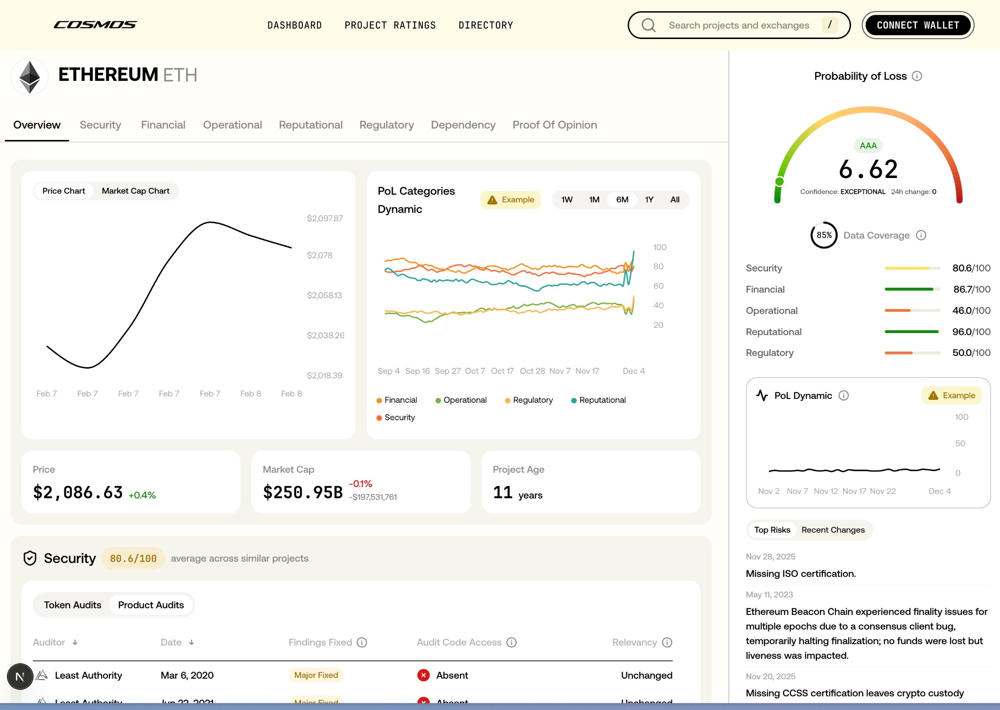
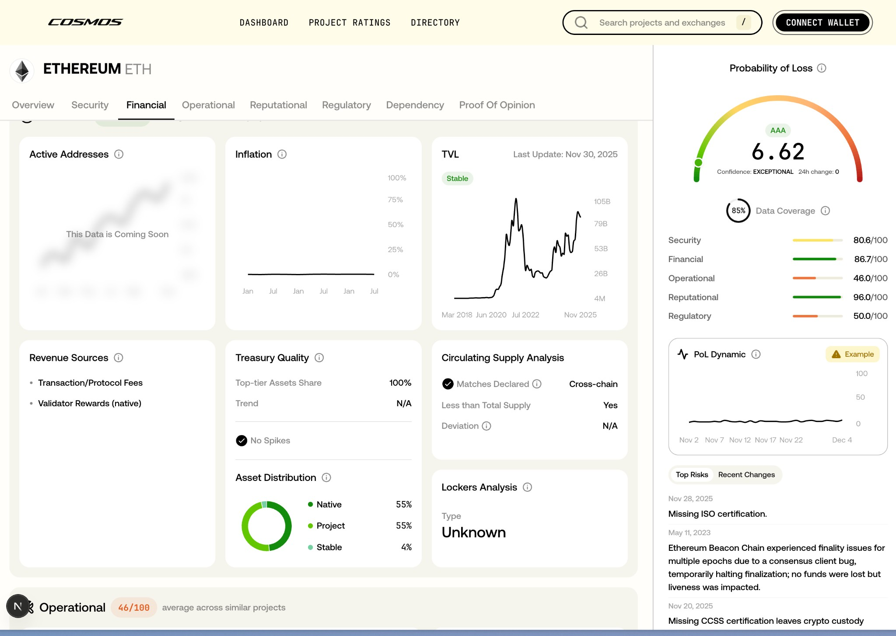
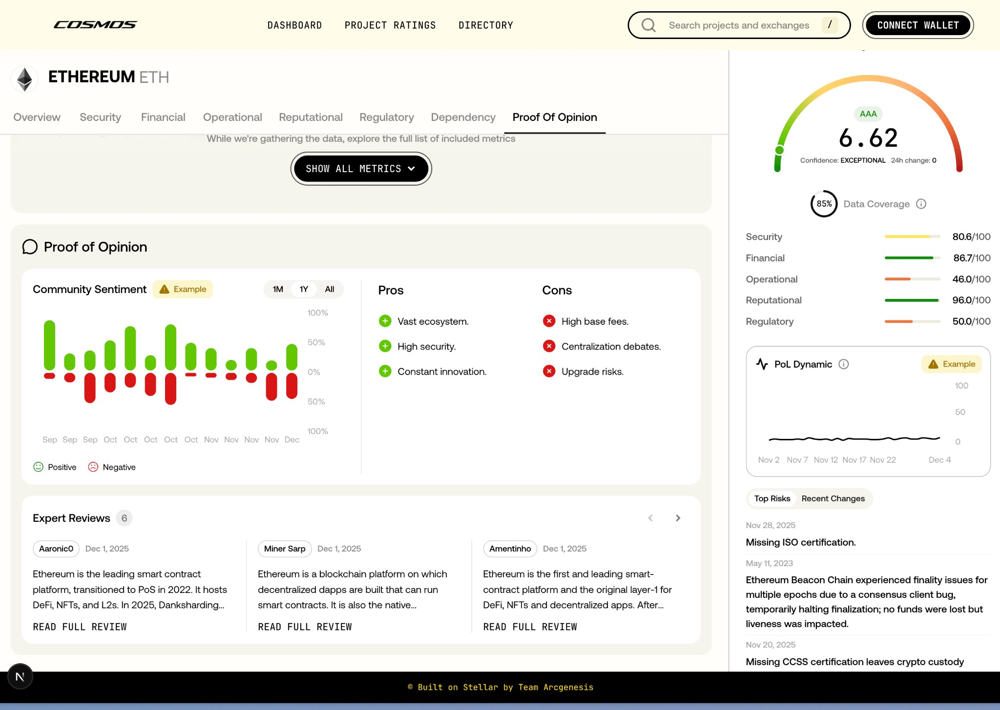
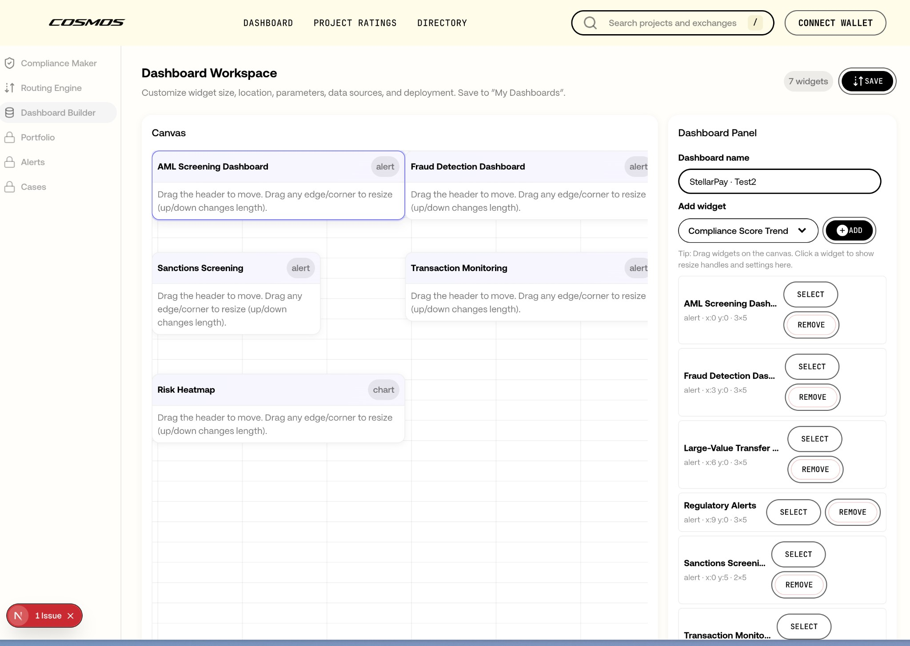

# Cosmos

Agentic dashboard builder + risk/ratings platform, with an AI backend that recommends widget bundles (Lean / Balanced / Comprehensive) and a frontend “n8n + powerbi like” dashboard workspace to customize layouts.


## What’s in this repo

- **`frontend/`**: Next.js app (Cosmos platform UI).
- **`ai-analyzer/`**: FastAPI service (“Cosmos AI Backend”) powering widget recommendations (OpenAI + heuristic fallback).



## Key features

- **Rankings & profiles**
  - Project Ratings list + detailed project profiles (PoL breakdown, categories, charts).
  - Directory (Exchange Ratings) list.
- **Workspaces**
  - Compliance Maker
  - Routing Engine
  - Agentic Builder (business inputs → widget bundle recommendations)
  - Dashboard Workspace (drag, resize, configure widgets; save dashboards to `localStorage`)
  - My Dashboards (saved dashboards list in sidebar)
- **AI recommendations**
  - Infers business category hints (remittance / fintech / bank / stablecoin / NGO / RWA / custom)
  - Produces 2–3 bundles with per-widget **why**, **time saved**, **cost savings**, and optional **ROI**

  

## Tech stack

- **Frontend**: Next.js (App Router), React 18, Emotion, TanStack Query, `react-rnd`
- **UI**: `@core3/ui-components` (workspace package)
- **Backend**: FastAPI + Uvicorn, Pydantic, OpenAI SDK, python-dotenv

## Quickstart (local dev)

### 1) Frontend

```bash
cd frontend
pnpm install
pnpm dev:platform
```

Platform runs at `http://localhost:3000`.



### 2) AI backend (FastAPI)

```bash
cd ai-analyzer
python -m venv .venv
source .venv/bin/activate
pip install -r requirements.txt
uvicorn app.main:app --reload --port 8001
```

Health check:

```bash
curl -sS http://localhost:8001/health
```

## Connecting frontend ↔ AI backend

The frontend calls a **same-origin Next.js proxy**:

- **Frontend endpoint**: `POST /api/agentic/widgets/recommendations`
- **Upstream**: `POST {COSMOS_AI_URL}/api/widgets/recommendations`

Configure the upstream backend URL:

- **`COSMOS_AI_URL`** (preferred, server-only)
- **`NEXT_PUBLIC_COSMOS_AI_URL`** (fallback)

If you don’t set anything, the proxy uses the default configured in the repo (can be updated to your Render URL).

### Example `.env.local` (frontend)

Create `frontend/apps/platform/.env.local`:

```bash
COSMOS_AI_URL=http://localhost:8001
```

## API reference (AI backend)

### `GET /health`

Returns:

```json
{ "status": "ok" }
```

### `POST /api/widgets/recommendations`

Minimal request:

```bash
curl -sS -X POST "http://localhost:8001/api/widgets/recommendations" \
  -H "Content-Type: application/json" \
  -d '{
    "business_name": "Acme Remit",
    "business_description": "We are a cross-border remittance company operating in US and India. We do bank and wallet payouts. Need compliance monitoring, routing performance, and alerting.",
    "business_type_hint": "Remittance company"
  }'
```

Notes:
- If `OPENAI_API_KEY` is not set, the backend responds with `"source": "heuristic"`.
- Set `OPENAI_MODEL` to override the default model (defaults to `gpt-4o-mini`).



## Deploy (AI backend on Render)

`ai-analyzer/render.yaml` includes a Render Blueprint for the FastAPI service.

- **Build**: `pip install -r requirements.txt`
- **Start**: `uvicorn app.main:app --host 0.0.0.0 --port $PORT`
- **Health check**: `/health`

Required Render env vars:
- `OPENAI_API_KEY`
- `CORS_ALLOW_ORIGINS` (comma-separated frontend origins)


## Repo notes

- Dashboards are currently saved to **browser `localStorage`** (hackathon-mode).
- The dashboard workspace uses **grid snapping** + `react-rnd` resizing/dragging.

---

© Built on Stellar by Team Arcgenesis

