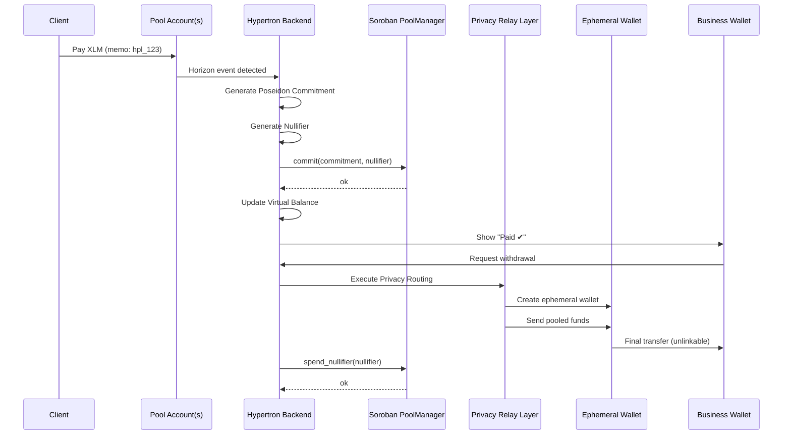

## User Onboarding Review Sheet

https://docs.google.com/spreadsheets/d/1t3ZQOgel-9NhzT6k8WI7Pu-mJnA12t2xoRACP4Mx6uA/edit?usp=sharing

## 🚀 Overview

Hypertron enables **private, workflow-native payments** for businesses—powered by Stellar Protocol 25 (X-Ray), Poseidon commitments, and a custom Privacy Relay Layer.

Businesses can:

* Create custom onboarding flows
* Collect payments privately
* Avoid exposing payer wallet addresses
* Withdraw funds without on-chain linkability
* Maintain an auditable history via commitments + nullifiers

Hypertron brings **darkpool-style privacy** to **B2B onboarding + payments**, without requiring an L2 or MPC.

---

## ✨ Features

### 🔹 **Custom Onboarding Flows**

* Forms, documents, agreements, borrower steps
* All combined into a single workflow link
* Auto-generates payment links after onboarding completion

### 🔹 **Private Payments**

* Client pays via Stellar
* Payment enters a shared pool
* Business **never** sees payer address
* Memo-based attribution

### 🔹 **Fee sponsorship (CAP-40 fee bump)** *(optional)*

When enabled, **payers still sign the inner payment** (same authorization as today), but a **dedicated sponsor account** wraps that transaction in a **fee bump** so the **sponsor pays the Stellar network fee** instead of the payer.

* **Flow:** `prepare-pay` → build inner tx → Freighter signs inner → `POST /api/payment-link/[id]/submit-sponsored-pay` → server validates destination, amount, and memo against the link + `PendingPaymentMemo` → sponsor signs outer fee bump → submit to Horizon.
* **Safety:** The API rejects inner transactions that do not match the expected recipient (relayer or pool), the prepared amount, and the registered memo hash (or fixed-amount text memo). This blocks abuse of the sponsor key for unrelated transfers.
* **Verification:** On [StellarExpert](https://stellar.expert), successful payments appear as **fee bump** transactions; expand the envelope to inspect the inner **payment** / **createAccount** operation.
* **Code:** `frontend/src/lib/fee-sponsor-server.ts`, `frontend/src/app/api/payment-link/[id]/submit-sponsored-pay/route.ts`, pay page branches in `frontend/src/app/pay/[id]/page.tsx`.

**Environment variables** (frontend / deployment):

| Variable | Required | Description |
| -------- | -------- | ----------- |
| `FEE_SPONSOR_SECRET` | Yes, to sponsor | Secret key of the sponsor `G...` account (server only). Must hold XLM for network fees. |
| `NEXT_PUBLIC_FEE_SPONSOR_PUBLIC_KEY` | Yes, to enable UX | Public key of the same sponsor. When set, the pay UI uses the sponsored submit path. |
| `FEE_SPONSOR_MAX_FEE_STROOPS` | No | Max fee (stroops) for the fee bump outer tx; default `100000`. |

If `NEXT_PUBLIC_FEE_SPONSOR_PUBLIC_KEY` is unset, payers submit the classic transaction themselves and pay their own base fee (previous behavior). The sponsor public key must match the key derived from `FEE_SPONSOR_SECRET` when both are set.

### 🔹 **ZK-Friendly Commitment Layer**

Using Stellar X-Ray primitives:

* Poseidon hashing
* BN254 operations
* Commitment + nullifier storage
* Prevents double-spend
* Keeps attribution private

### 🔹 **Privacy Relay Layer (Darkpool Settlement)**

Withdrawals routed through:

* One-time ephemeral wallets
* Multi-hop randomized routing
* Batching
* Timing obfuscation
* Amount jitter (±0.000001 XLM)

This breaks on-chain graph correlation.

### 🔹 **Virtual Balances**

Businesses see:

* Total received
* Pending withdrawals
* Completed payouts
  But never any on-chain flows.

## 🔁 End-to-End Flow (Sequence)

---

## 🧩 Core Components

### **1. Payment Links**

* Business configures workflow & amount
* Client pays to shared pool (or relayer when configured), optionally with **sponsored network fees** via fee bump
* Memo tags identify workflow

### **2. Attribution Engine**

* Matches memo → workflow
* Creates zk-friendly commitment
* Registers nullifier

### **3. PoolManager Contract**

* Stores commitments
* Tracks nullifiers
* Enforces double-spend protection
* Does *not* reveal balances

### **4. Privacy Relay Layer**

* Multi-hop routing
* Ephemeral wallets
* Batching
* Time randomization
* Amount jitter
* Breaks blockchain graph analysis

### **5. Business Dashboard**

* Virtual balance
* Payment events
* Withdrawals
* Workflow history

---

## 🛡 Security Model

### Privacy Guarantees

| Actor    | Can See                         | Cannot See                    |
| -------- | ------------------------------- | ----------------------------- |
| Business | Paid ✔ events, amount, workflow | Payer wallet, pool outflows   |
| Client   | Payment sent                    | Business balances/withdrawals |
| Observer | Pool inflow/outflow             | Mapping between them          |
| Contract | Commitments, nullifiers         | Identities, balances          |

### Integrity Guarantees

* Commitments must match real payments
* Nullifiers prevent double withdrawals
* Routing engine cannot break protocol rules

---

## 🧰 Tech Stack

* **Backend**: Node.js / TypeScript
* **Smart Contracts**: Soroban (Rust)
* **Hash Functions**: Poseidon / Poseidon2
* **Curves**: BN254 via Protocol 25
* **Routing Layer**: Multi-hop ephemeral wallets
* **Frontend**: React / Next.js

---

## 🗺 Roadmap

* [x] Payment link attribution
* [x] Payer fee sponsorship (Stellar fee bump on payment links)
* [x] Commitment + nullifier registry
* [x] Onboarding flow builder
* [x] Virtual balance engine
* [x] Ephemeral withdrawal accounts
* [ ] Batch withdrawal system
* [ ] Multi-pool routing
* [ ] Full ZK proof-of-withdrawal
* [ ] Audit ZK attestations

